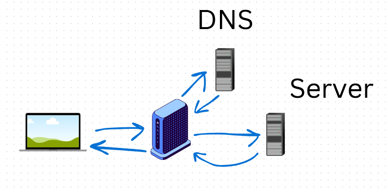
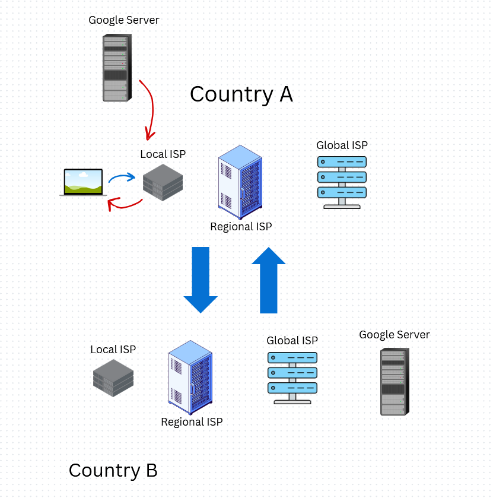
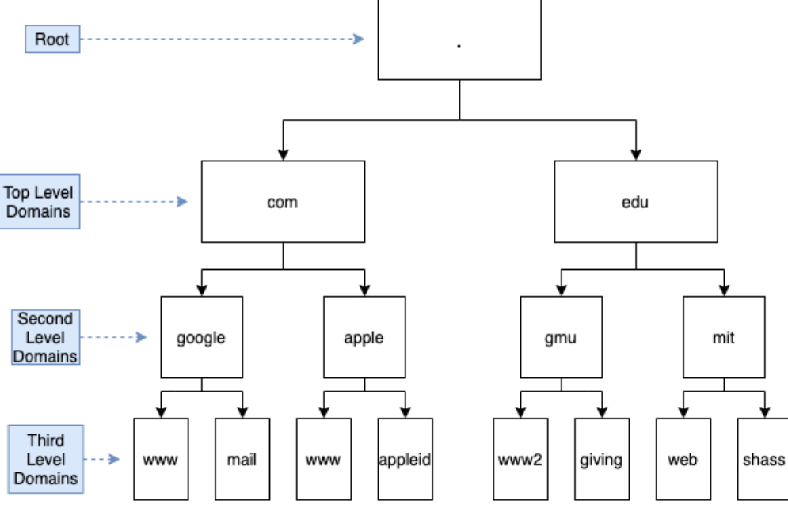
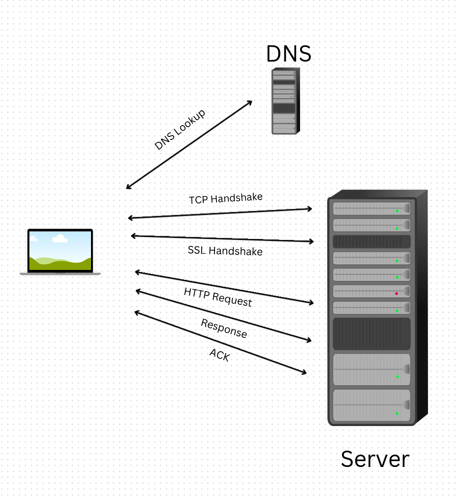
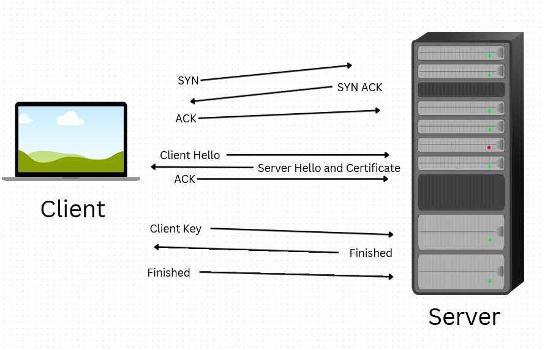

# how web works

- start with typing the address of the webpage
- this info goes to the ISP (Internet service provider) and reaches DNS (Domain Name System)
- DNS returns the IP Address mapped to that domain back to the ISP
- Every server is mapped to a IP address
- ISP calls the server by the IP address
- Server serves the webpage HTML and rest of the data
- 

## Cache

- when a URL is entered in a browser, it checks the its cache, service worker
- then in the Operating system
- inside the router also

### Peering

- google uses a technique called `peering`
  - in which the google server can bypass `Regional ISP` and `Global ISP`
- 

### ISP caching

- Data is placed strategically within ISP network, its `Content Delivery Network (CDN)`
- netflix CDN is called Open connect, wherein open connect appliances (OCAs) are placed within ISP

## DNS (Domain Name System)

- 
    - root
    - top level domain (.com, .edu, .gov)
    - second level domain (google, apple, nvidia, namastedev)
    - third level or subdomain (www, download, mail)
- the rules of domain mappings are regulated by ICANN
- WHOIS keeps info of domain created date, expiry date, renewal date etc, owner

## ISP (Internet service provider)

- data is sent and received as packets, not as one big chunk
- local ISP -> Regional ISP -> Global ISP -> servers Regional ISP -> Regional ISP local ISP -> target server

## Client server connection

- 
- TCP handshake sends acknowledgement to tell the server that "i'm ready" to receive
- later once the package is received it sends acknowledgement
- once the HTTP request is initilized the server responds with the first file
  - this file should be very small to show something on the screen

### SSL

- SSL is for HTTPS
- 
- server returns a SSL certificate
